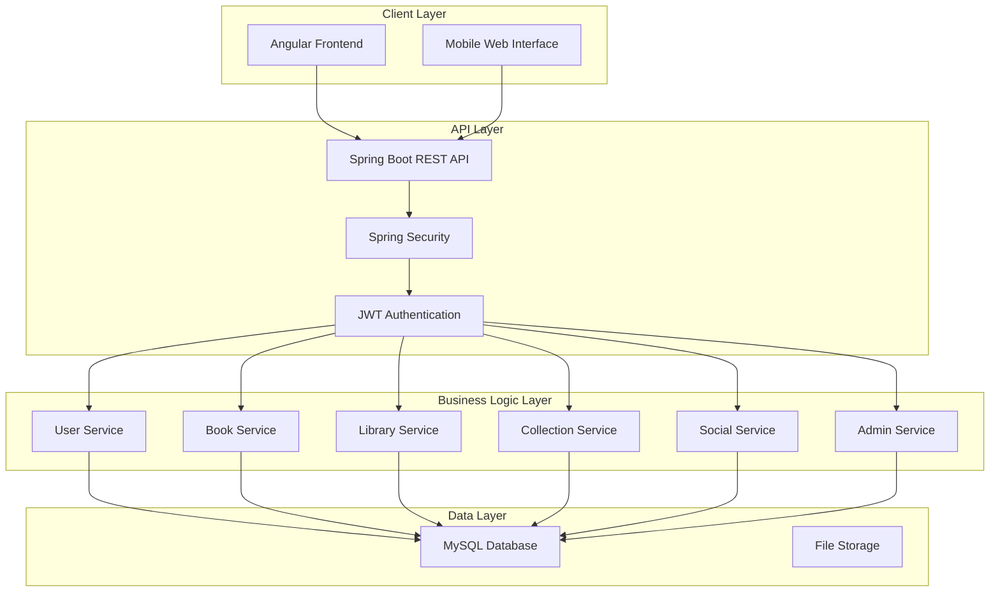

# Design Document

## Overview

The Booktracker application is a full-stack web application that provides book management and social reading capabilities. The system follows a modern three-tier architecture with an Angular frontend, Spring Boot backend, and MySQL database. The application supports user authentication, book catalog management, personal library tracking, social features, and administrative functions.

Key design principles:
- **Scalability**: Modular architecture supporting future growth
- **Security**: JWT-based authentication with role-based access control
- **Responsiveness**: Mobile-first design approach
- **Performance**: Efficient database queries and caching strategies
- **Maintainability**: Clean separation of concerns and well-defined APIs

## Architecture

### System Architecture



### Technology Stack

**Frontend:**
- Angular 17 with TypeScript
- Angular Router for navigation
- HttpClient for API communication
- Bootstrap 5 for responsive styling
- Angular Reactive Forms for form management

**Backend:**
- Spring Boot 3 with Java 17
- Spring Security for authentication and authorization
- JWT for stateless authentication
- BCrypt for password hashing
- Bean Validation for input validation
- JasperReports for report generation

**Database:**
- MySQL 8.0 for relational data
- Spring Data JPA for database operations
- Flyway for database migrations

**Infrastructure:**
- HTTPS for secure communication
- Spring Profiles for environment configuration
- Logback for logging
- Global exception handling## Compon
ents and Interfaces

### Frontend Components

#### Authentication Components
- `LoginForm`: Handles user login with validation
- `RegisterForm`: User registration with email verification
- `PasswordResetForm`: Password reset functionality
- `AuthGuard`: Route protection component

#### Book Management Components
- `BookCatalog`: Displays paginated book list with search/filter
- `BookCard`: Individual book display component
- `BookDetails`: Detailed book information view
- `BookSearch`: Search and filter interface

#### Library Management Components
- `PersonalLibrary`: User's book collection organized by status
- `LibraryStats`: Reading statistics dashboard
- `BookStatusSelector`: Reading status management
- `ReviewForm`: Book rating and review interface

#### Collection Components
- `CollectionList`: Display user's custom collections
- `CollectionForm`: Create/edit collection interface
- `CollectionBooks`: Books within a specific collection

#### Social Components
- `FriendsList`: User's friends management
- `MessageInbox`: Private messaging interface
- `FriendRequests`: Pending friend request management

#### Admin Components
- `AdminDashboard`: Administrative overview
- `BookManagement`: CRUD operations for books
- `CategoryManagement`: Category administration
- `ReportsPanel`: System reports and analytics

### Backend API Endpoints

#### Authentication Endpoints
```
POST /api/auth/register - User registration
POST /api/auth/login - User login
POST /api/auth/logout - User logout
POST /api/auth/forgot-password - Password reset request
POST /api/auth/reset-password - Password reset completion
GET /api/auth/verify-token - Token validation
```

#### Book Endpoints
```
GET /api/books - Get paginated book catalog
GET /api/books/search - Search books by title/author
GET /api/books/:id - Get book details
GET /api/books/categories - Get book categories
POST /api/books - Create book (admin only)
PUT /api/books/:id - Update book (admin only)
DELETE /api/books/:id - Delete book (admin only)
```

#### Library Endpoints
```
GET /api/library - Get user's personal library
POST /api/library/books - Add book to library
PUT /api/library/books/:id - Update book status/rating
DELETE /api/library/books/:id - Remove book from library
GET /api/library/stats - Get reading statistics
```

#### Collection Endpoints
```
GET /api/collections - Get user's collections
POST /api/collections - Create new collection
PUT /api/collections/:id - Update collection
DELETE /api/collections/:id - Delete collection
POST /api/collections/:id/books - Add book to collection
DELETE /api/collections/:id/books/:bookId - Remove book from collection
```

#### Social Endpoints
```
GET /api/friends - Get user's friends
POST /api/friends/request - Send friend request
PUT /api/friends/request/:id - Accept/decline friend request
DELETE /api/friends/:id - Remove friend
GET /api/messages - Get message conversations
POST /api/messages - Send message
GET /api/messages/:friendId - Get conversation with friend
```

#### Admin Endpoints
```
GET /api/admin/reports/books-by-category - Books distribution report
GET /api/admin/reports/daily-activity - Daily activity report
GET /api/admin/reports/user-engagement - User engagement report
GET /api/admin/categories - Get all categories
POST /api/admin/categories - Create category
PUT /api/admin/categories/:id - Update category
DELETE /api/admin/categories/:id - Delete category
```## Da
ta Models

### Database Schema

**Note: Using existing database schema with the following tables:**

#### Users Table
```sql
CREATE TABLE users (
    id INT AUTO_INCREMENT PRIMARY KEY,
    username VARCHAR(50) NOT NULL,
    email VARCHAR(100) NOT NULL,
    password VARCHAR(255) NOT NULL,
    created_at TIMESTAMP DEFAULT CURRENT_TIMESTAMP,
    is_admin TINYINT(1) DEFAULT 0
);
```

#### Books Table
```sql
CREATE TABLE books (
    id INT AUTO_INCREMENT PRIMARY KEY,
    title VARCHAR(255) NOT NULL,
    author VARCHAR(255) NOT NULL,
    published_year YEAR,
    thumbnail VARCHAR(255),
    description VARCHAR(500)
);
```

#### Genres Table
```sql
CREATE TABLE genres (
    id INT AUTO_INCREMENT PRIMARY KEY,
    name VARCHAR(100) NOT NULL
);
```

#### Book_Genres Table (Many-to-Many relationship)
```sql
CREATE TABLE book_genres (
    book_id INT NOT NULL,
    genre_id INT NOT NULL,
    PRIMARY KEY (book_id, genre_id),
    FOREIGN KEY (book_id) REFERENCES books(id) ON DELETE CASCADE,
    FOREIGN KEY (genre_id) REFERENCES genres(id) ON DELETE CASCADE
);
```

#### User_Books Table (Library)
```sql
CREATE TABLE user_books (
    id INT AUTO_INCREMENT PRIMARY KEY,
    user_id INT NOT NULL,
    book_id INT NOT NULL,
    status ENUM('read', 'to_read') NOT NULL,
    rating TINYINT,
    review TEXT,
    read_date DATE,
    isFavourite TINYINT(1) DEFAULT 0,
    FOREIGN KEY (user_id) REFERENCES users(id) ON DELETE CASCADE,
    FOREIGN KEY (book_id) REFERENCES books(id) ON DELETE CASCADE
);
```

#### Friendships Table
```sql
CREATE TABLE friendships (
    id INT AUTO_INCREMENT PRIMARY KEY,
    user_id INT NOT NULL,
    friend_id INT NOT NULL,
    status ENUM('pending', 'accepted', 'rejected') DEFAULT 'pending',
    FOREIGN KEY (user_id) REFERENCES users(id) ON DELETE CASCADE,
    FOREIGN KEY (friend_id) REFERENCES users(id) ON DELETE CASCADE
);
```

#### Recommendations Table (Book recommendations between friends)
```sql
CREATE TABLE recommendations (
    id INT AUTO_INCREMENT PRIMARY KEY,
    sender_id INT NOT NULL,
    receiver_id INT NOT NULL,
    book_id INT NOT NULL,
    message TEXT,
    created_at TIMESTAMP DEFAULT CURRENT_TIMESTAMP,
    FOREIGN KEY (sender_id) REFERENCES users(id) ON DELETE CASCADE,
    FOREIGN KEY (receiver_id) REFERENCES users(id) ON DELETE CASCADE,
    FOREIGN KEY (book_id) REFERENCES books(id) ON DELETE CASCADE
);
```

### TypeScript Interfaces

#### User Interface
```typescript
interface User {
    id: number;
    username: string;
    email: string;
    password: string;
    createdAt: Date;
    isAdmin: boolean;
}
```

#### Book Interface
```typescript
interface Book {
    id: number;
    title: string;
    author: string;
    publishedYear?: number;
    thumbnail?: string;
    description?: string;
    genres?: Genre[];
}
```

#### Genre Interface
```typescript
interface Genre {
    id: number;
    name: string;
}
```

#### UserBook Interface
```typescript
interface UserBook {
    id: number;
    userId: number;
    bookId: number;
    book: Book;
    status: 'read' | 'to_read';
    rating?: number;
    review?: string;
    readDate?: Date;
    isFavourite: boolean;
}
```

#### Friendship Interface
```typescript
interface Friendship {
    id: number;
    userId: number;
    friendId: number;
    status: 'pending' | 'accepted' | 'rejected';
}
```

#### Recommendation Interface
```typescript
interface Recommendation {
    id: number;
    senderId: number;
    receiverId: number;
    bookId: number;
    message?: string;
    createdAt: Date;
    sender: User;
    receiver: User;
    book: Book;
}
```#
# Error Handling

### Frontend Error Handling
- **HTTP Error Interceptor**: Centralized error handling for HTTP responses
- **Form Validation**: Real-time validation with user-friendly error messages
- **Error Service**: Angular service to handle and display errors
- **Toast Notifications**: User feedback for success/error states

### Backend Error Handling
- **Global Exception Handler**: Centralized error processing and logging using @ControllerAdvice
- **Validation Errors**: Structured validation error responses with Bean Validation
- **Authentication Errors**: Proper HTTP status codes for auth failures
- **Database Errors**: Graceful handling of database connection issues

### Error Response Format
```typescript
interface ErrorResponse {
    success: false;
    error: {
        code: string;
        message: string;
        details?: any;
    };
    timestamp: string;
}
```

### Common Error Scenarios
- **401 Unauthorized**: Invalid or expired authentication tokens
- **403 Forbidden**: Insufficient permissions for requested action
- **404 Not Found**: Requested resource doesn't exist
- **409 Conflict**: Duplicate username/email during registration
- **422 Validation Error**: Invalid input data format
- **500 Internal Server Error**: Unexpected server errors

## Testing Strategy

### Frontend Testing
- **Unit Tests**: Jasmine and Karma for component testing
- **Integration Tests**: Testing component interactions and API calls
- **E2E Tests**: Protractor or Cypress for critical user flows
- **Accessibility Tests**: Automated accessibility testing with axe-core

### Backend Testing
- **Unit Tests**: JUnit 5 for service and utility function testing
- **Integration Tests**: Spring Boot Test for API endpoint testing
- **Database Tests**: Test database operations with H2 in-memory database
- **Authentication Tests**: JWT token validation and authorization

### Test Coverage Goals
- **Unit Tests**: 80% code coverage minimum
- **Integration Tests**: All API endpoints covered
- **E2E Tests**: Critical user journeys (login, book management, social features)

### Testing Database Strategy
- **Test Database**: Separate MySQL instance for testing
- **Database Seeding**: Consistent test data setup
- **Transaction Rollback**: Clean state between tests
- **Migration Testing**: Verify database schema changes

## Security Considerations

### Authentication & Authorization
- **JWT Tokens**: Secure token-based authentication with expiration
- **Password Security**: bcrypt hashing with salt rounds
- **Role-Based Access**: Admin vs user permission levels
- **Session Management**: Secure token storage and refresh mechanisms

### Data Protection
- **Input Validation**: Server-side validation for all user inputs
- **SQL Injection Prevention**: Parameterized queries through Spring Data JPA
- **XSS Protection**: Content sanitization and CSP headers
- **HTTPS Enforcement**: All communication over secure connections

### Privacy & Compliance
- **Data Minimization**: Collect only necessary user information
- **Secure Storage**: Encrypted sensitive data storage
- **Audit Logging**: Track administrative actions and security events
- **Password Reset Security**: Time-limited tokens for password reset

## Performance Considerations

### Database Optimization
- **Indexing Strategy**: Indexes on frequently queried columns (user_id, book_id, email)
- **Query Optimization**: Efficient joins and pagination
- **Connection Pooling**: Database connection management
- **Caching Strategy**: Redis for frequently accessed data

### Frontend Performance
- **Code Splitting**: Lazy loading of route components
- **Image Optimization**: Responsive images and lazy loading
- **Bundle Optimization**: Tree shaking and minification
- **Caching Strategy**: Browser caching for static assets

### API Performance
- **Pagination**: Limit large dataset responses
- **Response Compression**: Gzip compression for API responses
- **Rate Limiting**: Prevent API abuse
- **Monitoring**: Performance metrics and logging