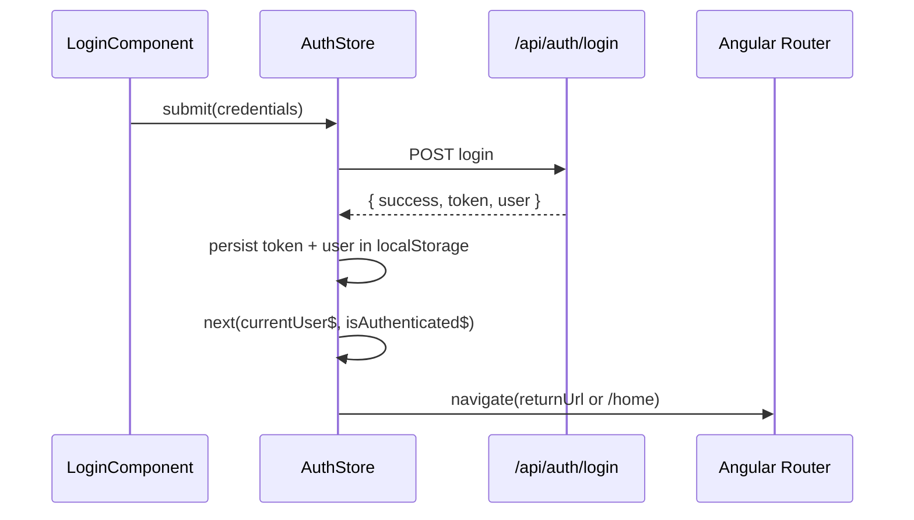
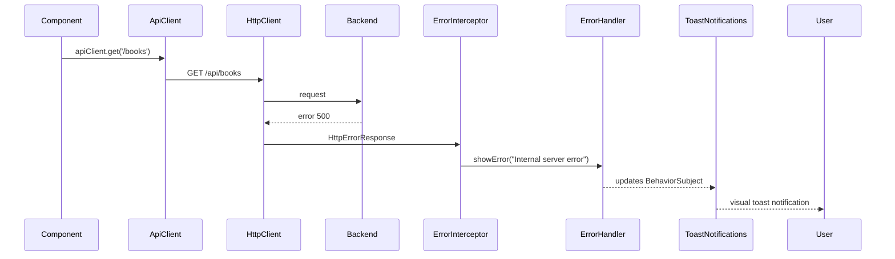
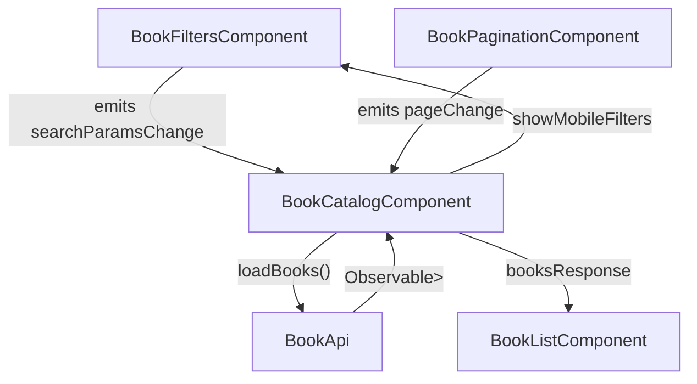

# System Deep Dives

This companion guide explains the major subsystems that power the Booktracker frontend. Use it alongside `frontend-overview.md` when preparing demonstrations or onboarding new contributors.

---

## 1. Authentication & Authorization Flow

### Core Participants

- `AuthStore` (`services/auth-store.ts`) handles login, logout, token persistence, and exposes reactive session state.
- `AuthInterceptor` (`interceptors/auth-interceptor.ts`) attaches the bearer token to every API request and logs out on `401` responses.
- `AuthGuard`, `GuestGuard`, `AdminGuard` (`guards/auth-guard.ts`) keep routes secure by consulting the `AuthStore`.

### Sequence

### Key Behaviors

- Session state survives page reloads via `localStorage`. `AuthStore.initializeAuth()` hydrates the BehaviorSubjects during service construction.
- `AdminGuard` relies on `authStore.isAdmin()` to allow access to `/admin/**` routes. Ensure the backend sets `isAdmin` on the login response.
- Token revocation is graceful: if the backend responds `401`, the interceptor calls `authStore.logout()` and redirects the user to login, maintaining a clean state.

### Demo Talking Points

- Show how the navbar reacts to `currentUser$` (e.g., displays avatar/username when logged in).
- Mention the `returnUrl` query parameter so the user returns to the intended page after logging in.

---

## 2. HTTP Client, Interceptors & Error Toasts

### Components

- `ApiClient` consolidates GET/POST/PUT/DELETE helpers and ensures headers include JSON + token.
- `ErrorInterceptor` intercepts failing HTTP calls, runs custom logic, and feeds the `ErrorHandler` service.
- `ErrorHandler` stores toast messages in a `BehaviorSubject` with metadata (type, timestamp, auto-hide).
- `ToastNotificationsComponent` subscribes to the message stream and renders Bootstrap-styled toasts in the app shell.

### Flow Diagram

### Configuration Tips

- Skip lists in `ErrorInterceptor.shouldSkipErrorHandling()` let specific components manage their own validation errors (e.g., login form). Mention this when explaining how UX stays contextual.
- Toasts auto-dismiss after 5 seconds unless `autoHide` is `false`. Components can use `ErrorHandler.showSuccess()` to provide positive feedback (e.g., “Book added to library”).

---

## 3. Book Catalog Search Orchestration

### Components & Services

- `BookCatalogComponent` orchestrates the feature.
- Child components:
  - `BookFiltersComponent`: manages search inputs and emits debounced filter changes.
  - `BookListComponent`: presents the paginated book grid and handles loading/error states.
  - `BookPaginationComponent`: renders responsive pagination controls.
  - `MobileFilterToggleComponent`: exposes filter drawer on small screens.
- `BookApi` interacts with `/books`, `/books/filter`, `/books/popular`, etc.

### Data Flow

### Noteworthy Mechanics

- `BookFiltersComponent` uses an RxJS `Subject` to debounce typing by 500 ms, avoiding excessive API calls.
- `BookApi.getBooks()` dynamically swaps between `/books` and `/books/filter` endpoints depending on whether meaningful filters are present.
- `BookCatalogComponent` exposes `getActiveFiltersCount()` to badge the mobile filter toggle, helping users stay aware of active filters.

---

## 4. Library Synchronization Events

### Use Case

The library sections (personal library, stats widget, review form) need to stay synchronized when a user adds/removes books or updates progress.

### Mechanism

- `LibraryEvents` service exposes a `libraryUpdated$` observable.
- When `LibraryApi` mutates the library (add/remove/update), components call `libraryEvents.notifyLibraryUpdated()`.
- Any component that needs fresh data subscribes to `libraryUpdated$` and refreshes its view.

### Benefits

- Decouples components that live on different routes or at different depths.
- Avoids prop drilling through intermediate components and keeps the service layer as the single source of truth.

### Demonstration Idea

While presenting, update a book's status in the review form and show how the stats card updates without a full page refresh.

---

## 5. Social Notifications & Polling Strategy

### Participants

- `SocialApi` holds social endpoints plus notification polling logic.
- `SocialDashboardComponent` adjusts polling frequency when the user is actively on social pages.

### Polling Behavior

1. When a user authenticates, `SocialApi` begins polling `/notifications/count` every 30 seconds.
2. Entering the social dashboard calls `startFrequentPolling()` (10-second intervals) to keep counts fresh.
3. Leaving the dashboard triggers `resumeNormalPolling()` to conserve network usage.
4. Logout stops the interval and resets counts to zero.

### UX Impact

Notification badges (friend requests, recommendations) update reactively via a `BehaviorSubject`, keeping the sidebar counts current even if the user is not refreshing the page.

---

## 6. File Uploads & Profile Management

- `UserApi.uploadAvatar()` sends multipart form data to update the avatar stored in the backend filesystem (see `uploads/avatars/`).
- After a successful upload the component should call `AuthStore.updateStoredUser({ avatarUrl })` so the navbar and profile reflect the new image instantly.
- `environment.assetsUrl` centralizes the asset base path, used by components to resolve avatar and cover image URLs.

---

## 7. Slider Utility

- Shared slider logic lives in `utils/slider.util.ts`, with corresponding Jasmine tests (`slider.util.spec.ts`).
- Components such as `shared/slider` use these helpers to calculate positions, handle inertia, and provide a polished carousel experience.
- Highlighting the availability of unit-tested utilities underscores the team's focus on reusability and reliability.

---

## 8. Presentation Checklist & Talking Points

- **Architecture:** Emphasize standalone components, lazy routes, and typed services.
- **Resilience:** Describe interceptors, toasts, and the `LibraryEvents` bus as safeguards against inconsistent state.
- **Scalability:** Mention how feature folders and service abstractions make it easy to extend (e.g., new admin panels, additional social features).
- **Future Work Suggestions:**
  - Add WebSocket support for real-time social updates (could replace polling).
  - Implement skeleton loaders in `BookListComponent` for better perceived performance.
  - Expand unit test coverage to guards and interceptors.
  - Provide localization scaffolding if multi-language support becomes a priority.

Use this guide to explain _how_ key experiences are wired together and why the current design choices support maintainability and growth.
